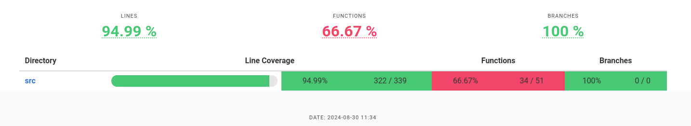

# Overview

This is a rust library used for authorization spefically for image (container) mirroring

It uses the $XDG_RUNTIME_DIR/containers/auth.json file as reference. If this fails it will try &HOME/.docker/json


## Usage

To include this library in you rust project, add this line to your Cargo.toml (at time of writing the current version was 0.6.0 - change accordingly)

```
mirror-auth = { git = "https://github.com/lmzuccarelli/rust-mirror-auth", branch = "main", version = "0.6.0" }
```

In your code add these lines 

```bash
use mirror_auth;
let t_impl = ImplTokenInterface {};

// this assumes you have parsed the image into its parts
// registry
// namespace
// name
let token = get_token(
  t_impl.clone(),
  log,
  registry,
  format!("{}/{}",namespace,name
  true,
))
.await?;
```

Current code coverage map




